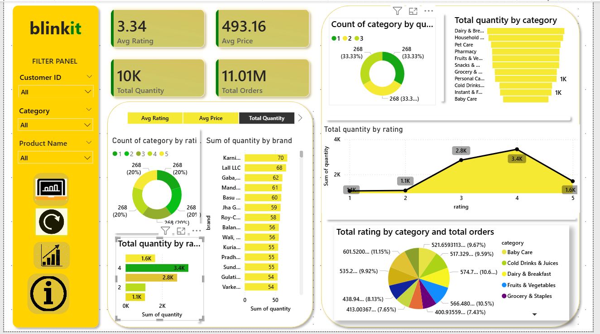

# 🚀 Blinkit Smart Analytics Dashboard | Power BI

## 📌 Project Overview

"Blinkit Smart Analytics Dashboard" is an interactive Business Intelligence project developed using "Microsoft Power BI" to analyze Blinkit sales and operational data.

The project transforms raw sales data into meaningful visual insights using data cleaning, transformation, data modeling, DAX calculations, and interactive visualizations.

The dashboard provides a consolidated view of key business metrics and helps understand sales performance, product performance, quantity distribution, customer ratings, and category-wise trends.

---

## 🎯 Project Objective

The main objective of this project is to:

- Analyze overall sales performance
- Track key business KPIs
- Understand product and category performance
- Analyze quantity sold and ratings
- Identify important trends and patterns
- Create an interactive and user-friendly dashboard
- Convert raw data into actionable business insights

---

## 🛠️ Tools & Technologies

| Tool / Technology | Purpose                                 |
| ----------------- | --------------------------------------- |
| Power BI          | Dashboard development and visualization |
| Power Query       | Data cleaning and transformation        |
| DAX               | Measures and calculated metrics         |
| Data Modeling     | Structuring data for analysis           |
| Excel / CSV       | Source data handling                    |

---

## 📊 Key KPIs

The dashboard provides insights into important business metrics such as:

* 💰 Total Sales
* 🛒 Total Orders
* 📦 Total Quantity Sold
* ⭐ Average Rating
* 🏷️ Category-wise Performance
* 📊 Product-wise Performance
* 📈 Sales Trends
* 🔎 Interactive filtering and segmentation

---

## 📈 Dashboard Features

### 1. Sales Analysis

Analyze overall sales performance and identify sales trends.

### 2. Product Analysis

Understand which products contribute to overall sales and quantity.

### 3. Category Analysis

Compare different product categories based on sales and quantity.

### 4. Rating Analysis

Analyze the relationship between product ratings and quantity sold.

### 5. Interactive Filters

Users can interact with the dashboard using slicers and filters to explore specific segments of the data.

### 6. KPI Cards

Important business metrics are displayed using easy-to-understand KPI cards.

---

## 🧹 Data Preparation

The dataset was prepared before building the dashboard.

The data preparation process included:

* Removing duplicate records
* Handling missing values
* Correcting data types
* Cleaning inconsistent values
* Transforming columns
* Creating required calculated fields
* Preparing the data for analysis

These transformations were performed using "Power Query".

---

## 🧮 DAX & Data Modeling

DAX was used to create calculated measures and business metrics required for the dashboard.

Examples of analytical measures include:

* Total Sales
* Total Quantity
* Total Orders
* Average Rating
* Category-level metrics
* Product-level metrics

The data model was designed to support efficient filtering and interactive analysis.

---

## 💡 Key Insights

The dashboard helps identify:

* Overall sales performance
* High-performing product categories
* Products contributing significantly to sales
* Quantity distribution across categories
* Rating patterns
* Business trends based on available data

These insights can help businesses make more informed, data-driven decisions.

---

## 📷 Dashboard Preview

Add your dashboard screenshot here:


## 📷 Dashboard Preview




---

## 📁 Project Structure

```text
Blinkit-Smart-Analytics-PowerBI/
│
├── Dataset/
│   └── blinkit_sales.csv
│
├── PowerBI/
│   └── Blinkit_Smart_Analytics_Dashboard.pbix
│
├── Screenshots/
│   └── dashboard.png
│
└── README.md
```

---

## 📚 Skills Demonstrated

Through this project, I demonstrated practical knowledge of:

* Power BI
* Power Query
* DAX
* Data Cleaning
* Data Transformation
* Data Modeling
* Data Visualization
* Business Intelligence
* Exploratory Data Analysis
* Dashboard Development
* Business-oriented Data Analysis

---

## 🎓 Learning Outcomes

This project helped me strengthen my practical understanding of the complete data analytics workflow:

Raw Data → Data Cleaning → Data Transformation → Data Modeling → DAX → Visualization → Business Insights

It also improved my ability to present complex datasets in a simple and interactive format.

---

## 🚀 Future Improvements

Some possible improvements for this project include:

* Adding advanced DAX measures
* Adding time-series analysis
* Creating customer segmentation
* Adding sales forecasting
* Adding advanced KPI tracking
* Connecting the dashboard to a live data source
* Integrating SQL-based data analysis

---

#PowerBI #DataAnalytics #BusinessIntelligence #DataVisualization #DataAnalyst #DAX #PowerQuery
